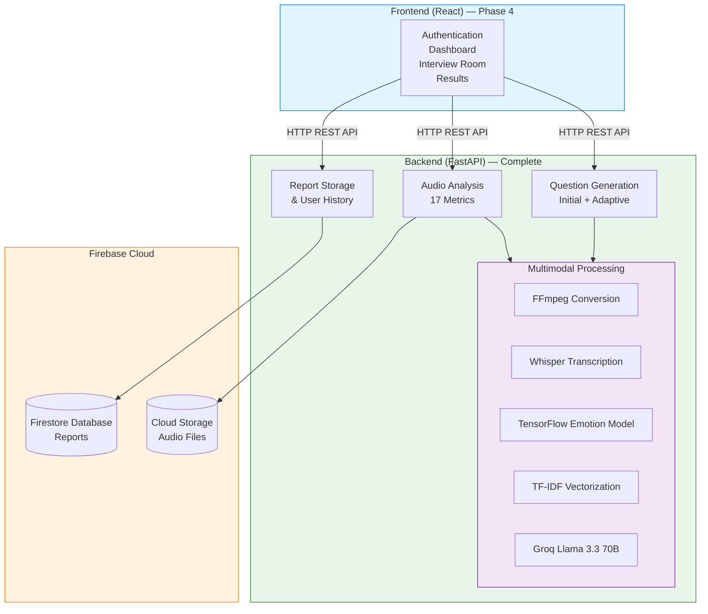
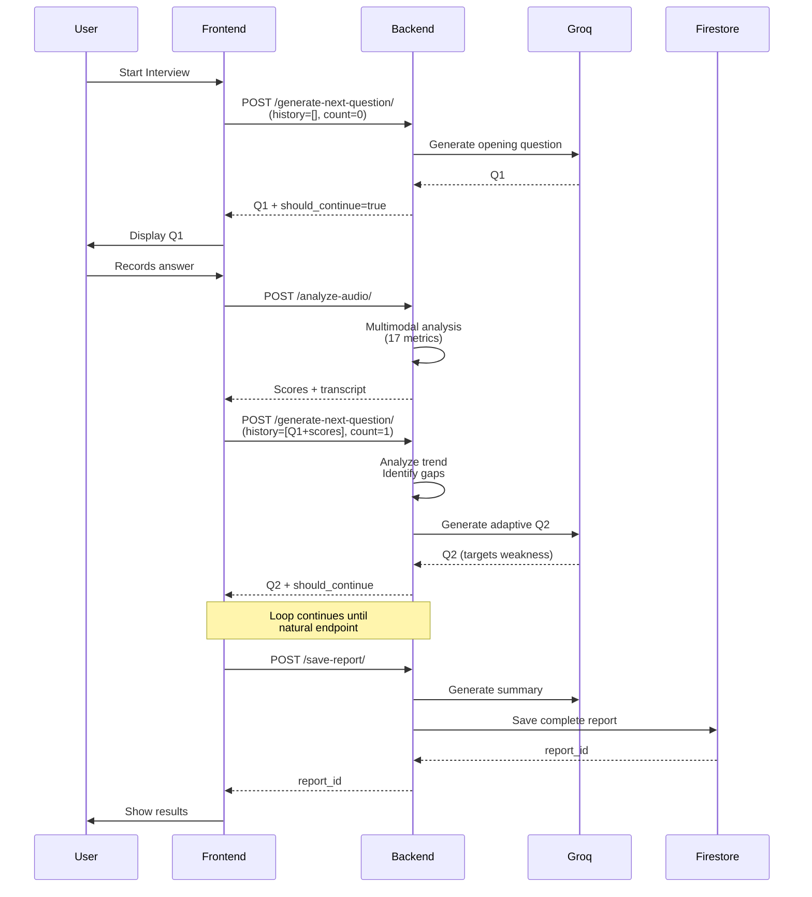

# IntWiz — AI-Powered Interview Preparation Platform

**IntWiz** is an intelligent interview preparation system that simulates real-world job interviews using multimodal AI analysis. It evaluates candidates through acoustic emotion recognition, linguistic fluency analysis, semantic relevance scoring, and structured answer assessment to provide transparent performance feedback. The system features adaptive questioning that dynamically generates follow-up questions based on candidate performance.

[](https://www.python.org/)
[](https://fastapi.tiangolo.com/)
[](https://www.tensorflow.org/)
[](https://firebase.google.com/)
[]()

---

## 🎯 Key Features

### ✅ Implemented (Phase 1, 2 & 3 Complete)

**Multimodal Analysis Pipeline:**
- **Acoustic Emotion Recognition** — 7-class MLP classifier (angry, disgust, fearful, happy, neutral, sad, surprised) trained on 12,000+ audio samples
- **Speech-to-Text Transcription** — Whisper large v3 integration via Groq API
- **Fluency Metrics** — Words per minute (WPM) and filler word detection
- **Pause Quality Analysis** — Strategic pause vs hesitation detection (Goldman-Eisler 1968)
- **Semantic Relevance Scoring** — TF-IDF cosine similarity against CV and job description
- **Technical Depth Score** — LLM-based domain terminology density analysis
- **Response Pacing** — Optimal answer length evaluation (Barrick et al. 2009)
- **STAR Method Analysis** — Automated assessment of answer structure

**Adaptive Interview System:**
- **AI-Generated Questions** — Personalized questions based on CV and job description
- **Adaptive Follow-Up Logic** — Each question generated dynamically based on previous performance
- **Conversation History Tracking** — Performance trends inform next question difficulty
- **Intelligent Stopping Criteria** — Natural endpoint detection or fixed-length mode
- **Privacy-First Audio Storage** — Optional Firebase Cloud Storage with 30-day auto-cleanup

**Persistence & Analytics:**
- **Firebase Authentication** — Secure user account management
- **Firestore Database** — Interview reports with comprehensive metadata
- **Cloud Storage** — Optional audio recording preservation
- **Weighted Scoring Fusion** — Research-backed multi-metric score aggregation
- **AI-Generated Summaries** — Personalized feedback via Llama 3.3 70B

### 🚧 In Development (Phase 4 & 5)

- React frontend with adaptive interview UI
- Performance dashboard with historical analytics
- Real-time progression tracking
- PDF report generation
- Production deployment

---

## 🏗️ System Architecture



### Component Breakdown

| Layer | Components | Status |
|-------|-----------|--------|
| **Frontend** | React + TypeScript + Tailwind | Phase 4 |
| **API Gateway** | FastAPI with 7 endpoints | Complete |
| **ML Pipeline** | TensorFlow + librosa + sklearn | Complete |
| **AI Services** | Groq API (Llama + Whisper) | Complete |
| **Database** | Firebase Firestore (NoSQL) | Complete |
| **Storage** | Firebase Cloud Storage | Complete |
| **Auth** | Firebase Authentication | Complete |

---

## 🧠 Technical Implementation

### Acoustic Emotion Recognition

- **Model:** Sequential MLP (4 dense layers: 512 → 256 → 128 → 64 → 7)
- **Input:** 193 acoustic features (40 MFCCs, 12 Chroma, 128 Mel Spectrogram, 7 Spectral Contrast, 6 Tonnetz)
- **Output:** 7-class emotion classification
- **Training Data:** 12,000+ samples from RAVDESS, TESS, CREMA-D, SAVEE
- **Performance:** 65% accuracy on test set
- **Regularization:** Batch normalization + dropout between layers

### Natural Language Processing

- **Speech-to-Text:** Groq-hosted Whisper large v3 (free tier, <2s latency)
- **Question Generation:** Llama 3.3 70B with adaptive context awareness
- **Relevance Scoring:** sklearn TF-IDF + cosine similarity
- **Technical Depth:** Dynamic LLM-based term extraction with density analysis
- **STAR Analysis:** LLM structural assessment with component detection

### Audio Processing

- **Format Conversion:** FFmpeg (browser webm → 16kHz mono wav)
- **Pause Detection:** librosa silence segmentation (top_db=30)
- **Feature Extraction:** librosa for MFCCs, Chroma, Mel, Spectral, Tonnetz

### Adaptive Question Generation Flow



---

## 📊 Evaluation Metrics

The system calculates **17 metrics per answer** across 6 dimensions:

| Dimension | Metrics | Research Backing |
|-----------|---------|------------------|
| **Acoustic** | tone, confidence, engagement | Scherer (2003), DeGroot & Motowidlo (1999) |
| **Fluency** | WPM, filler words, fluency score | Bortfeld et al. (2001), Christenfeld (1995) |
| **Pause** | count, duration, quality score | Goldman-Eisler (1968) |
| **Semantic** | relevance, technical depth | Maurer & Fay (1988), Huffcutt et al. (2001) |
| **Pacing** | duration assessment, word count | Barrick et al. (2009) |
| **Structure** | STAR score, components detected | Latham et al. (1980), Campion et al. (1997) |

Full academic justification in [`EVALUATION_CRITERIA.md`](./EVALUATION_CRITERIA.md).

### Weighted Scoring Algorithm

```
final_score = (
    relevance_score × 0.25 +        # Job fit (most predictive)
    technical_depth × 0.20 +        # Domain expertise
    star_score × 0.15 +             # Answer structure
    fluency_score × 0.15 +          # Communication clarity
    pacing_score × 0.10 +           # Answer discipline
    pause_quality × 0.08 +          # Delivery confidence
    confidence_score × 0.07         # Vocal tone (limited reliability)
)
```

**Rationale:** Content metrics (60%) > Communication metrics (33%) > Acoustic metrics (7%)

---

## 🚀 Quick Start

### Prerequisites

- Python 3.11+
- FFmpeg (for audio conversion)
- Groq API key (free at https://console.groq.com)
- Firebase project with Firestore and Cloud Storage enabled

### Installation

```bash
# Clone repository
git clone https://github.com/kaveenjay/IntWiz.3.0.git
cd IntWiz.3.0

# Create virtual environment
python -m venv venv
venv\Scripts\activate   # Windows
source venv/bin/activate   # Mac/Linux

# Install dependencies
cd backend
pip install -r requirements.txt
```

### Configuration

Create `backend/.env`:

```
GROQ_API_KEY=your_groq_api_key_here
```

Add Firebase credentials:
- Download `serviceAccountKey.json` from Firebase Console
- Place in `backend/serviceAccountKey.json`
- Already gitignored for security

### Run Backend

```bash
cd backend
uvicorn main:app --reload
```

- Server: http://127.0.0.1:8000
- API Docs: http://127.0.0.1:8000/docs (Swagger UI)

---

## 📡 API Endpoints

### Question Generation

#### `POST /generate-questions/`

Pre-generates a fixed set of interview questions from CV and job description.

**Request:**
- `cv_file`: PDF (required)
- `job_description_file`: PDF (optional)
- `job_description_text`: String (optional)
- `num_questions`: Integer (default: 7)

#### `POST /generate-next-question/` 

Adaptive question generation based on conversation history.

**Request:**
- `cv_text`: String
- `job_description_text`: String
- `conversation_history`: JSON array of previous Q&A with scores
- `current_question_count`: Integer
- `target_questions`: Integer (0 = adaptive mode)

**Response:**

```json
{
  "question": "Can you describe a specific project where...",
  "should_continue": true,
  "question_number": 3,
  "reasoning": "Adaptive question for Q3; performance trend: improving"
}
```

---

### Audio Analysis

#### `POST /analyze-audio/`

Comprehensive multimodal analysis of interview answers.

**Request:**
- `file`: Audio file (.wav, .mp3, .webm, .m4a, .mp4)
- `cv_text`: String (optional)
- `job_description_text`: String (optional)
- `question`: String (optional)
- `save_audio`: Boolean (default: false) — opt-in audio storage
- `user_id`: String (required if saving audio)
- `interview_id`: String (required if saving audio)
- `question_number`: Integer (default: 1)

**Response:** 17 metrics including transcript, scores, and optional audio URL

---

### Report Persistence

#### `POST /save-report/`

Saves complete interview to Firestore with AI-generated summary.

**Request:**
- `user_id`: String
- `cv_text`, `jd_text`: Strings (truncated to 2000 chars)
- `interview_results`: JSON array of all Q&A with scores
- `target_questions`: Integer

**Response:**

```json
{
  "report_id": "abc123xyz",
  "status": "success",
  "overall_score": 74.6,
  "ai_summary": "Your responses showed exceptional fluency..."
}
```

#### `GET /get-report/{report_id}`

Fetches single interview report with full data.

#### `GET /get-user-reports/{user_id}`

Lists user's interviews sorted by date (newest first).

**Query params:**
- `limit`: Integer (default: 20)

---

## 🛠️ Technology Stack

### Backend
- **Framework:** FastAPI 0.115.6
- **ML/DL:** TensorFlow 2.18.0, scikit-learn 1.6.1
- **Audio:** librosa 0.10.2, FFmpeg
- **LLM/STT:** Groq API (Llama 3.3 70B, Whisper large v3)
- **PDF Processing:** PyMuPDF (fitz)
- **Database:** Firebase Firestore (NoSQL)
- **Storage:** Firebase Cloud Storage
- **Auth:** Firebase Authentication

### Frontend (Phase 4)
- **Framework:** React 18 + TypeScript
- **Styling:** Tailwind CSS
- **State:** React Context + hooks
- **Routing:** React Router DOM v6
- **HTTP:** Axios
- **Auth:** Firebase Auth SDK

### Datasets (Training)
- **RAVDESS** — Ryerson Audio-Visual Database of Emotional Speech and Song
- **TESS** — Toronto Emotional Speech Set
- **CREMA-D** — Crowd-sourced Emotional Multimodal Actors Dataset
- **SAVEE** — Surrey Audio-Visual Expressed Emotion Dataset

---

## 📊 Development Status

| Phase | Status | Features |
|-------|--------|----------|
| **Phase 1: ML Foundation** | Complete | TensorFlow emotion classifier, FastAPI setup, acoustic feature extraction |
| **Phase 2: NLP Integration** | Complete | Whisper STT, question generation, fluency metrics, relevance scoring, STAR analysis |
| **Phase 3: Backend Services** | Complete | Firebase integration, adaptive questioning, audio storage, report persistence |
| **Phase 4: Frontend** | Next | React UI, interview simulation, results dashboard |
| **Phase 5: Deployment** | Planned | Vercel (frontend), Railway/Render (backend) |

---

## 📝 Known Limitations

### Acoustic Model Domain Shift

The emotion recognition model was trained on **acted emotional expressions** (exaggerated theatrical speech). This creates accuracy issues when applied to professional interview speech, which is naturally controlled and measured. Documented in [DECISIONS.md](./DECISIONS.md).

**Impact:** Acoustic scores may underestimate professional delivery quality.

**Mitigation:** Linguistic features (relevance, fluency, technical depth, STAR) carry higher weight in final scoring (93% vs 7% acoustic).

### TF-IDF Synonym Handling

Cannot recognize synonyms ("machine learning" vs "ML") or paraphrasing. Hybrid scoring with sentence transformers documented as future enhancement.

### Adaptive Mode Boundaries

Stopping criteria are heuristic-based (10 question max, <40 score threshold). A production system would benefit from validation studies to optimize these thresholds.

---

## 🎓 Academic Context

**Final Year Individual Project**  
**BSc (Hons) Data Science — University of Plymouth**  
**Student:** Kaveen Jayamanne (ID: 10953765)  
**Supervisor:** Ms. Lakni Peiris

**Research Areas:**
- Applied Machine Learning & Deep Learning
- Natural Language Processing
- Adaptive Learning Systems
- Human-Computer Interaction
- Explainable AI in Automated Assessment

**Project Objectives:**
1. Demonstrate multimodal AI integration in a practical application
2. Evaluate trade-offs between model complexity and explainability
3. Address domain adaptation challenges (acted vs professional speech)
4. Implement adaptive questioning with real-time performance analysis
5. Build production-ready software with proper documentation and testing

---

## 📚 Documentation

- **[DECISIONS.md](./DECISIONS.md)** — Technical architecture decisions and justifications
- **[EVALUATION_CRITERIA.md](./EVALUATION_CRITERIA.md)** — Research-backed evaluation framework
- **[docs/wireframes/](./docs/wireframes/)** — UI/UX wireframes for all screens
- **Swagger UI** — Interactive API documentation at `http://localhost:8000/docs`
- **Code Comments** — Inline explanations of algorithms and design choices

---

## 🔮 Future Enhancements

1. **Domain-Specific Model Fine-Tuning**
   - Collect real interview recordings with expert labels
   - Retrain acoustic model on professional speech patterns
   - Recalibrate engagement metrics for controlled delivery

2. **Hybrid Semantic Scoring**
   - Combine TF-IDF with lightweight sentence transformers
   - Handle synonyms and paraphrasing effectively

3. **Advanced Analytics**
   - Comparative analysis across multiple sessions
   - Skill gap identification and learning path recommendations
   - Industry benchmark comparisons

4. **Difficulty Adaptation**
   - Item Response Theory implementation
   - Questions auto-adjust complexity based on performance

5. **Extended Platform Features**
   - Video analysis (facial expressions, eye contact)
   - Real-time feedback during practice
   - Custom question bank creation for recruiters
   - Multi-language support (Whisper supports 99 languages)

---

## 📈 Project Statistics

- **Total Endpoints:** 7 working APIs
- **Metrics per Answer:** 17 across 6 dimensions
- **Lines of Code:** ~1,200 (backend)
- **Git Commits:** Clean, feature-by-feature history
- **Documentation Files:** 5 comprehensive docs
- **Datasets Used:** 4 emotion recognition corpora
- **Research Citations:** 9+ peer-reviewed papers

---

## 📧 Contact

**Developer:** Kaveen Jayamanne  
**Email:** jayamannekaveen@gmail.com  
**LinkedIn:** [linkedin.com/in/jayamannekaveen](https://linkedin.com/in/jayamannekaveen)  
**Institution:** University of Plymouth

---

## 📄 License

This project is developed for academic purposes as part of a university final year project.

---

*Last Updated: April 2026 | Phase 3 Complete*