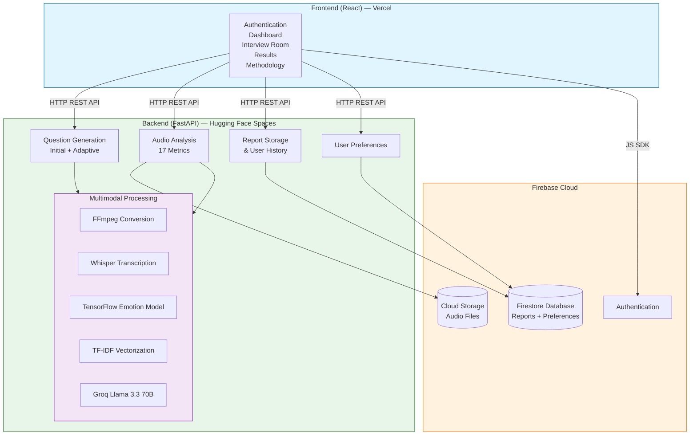
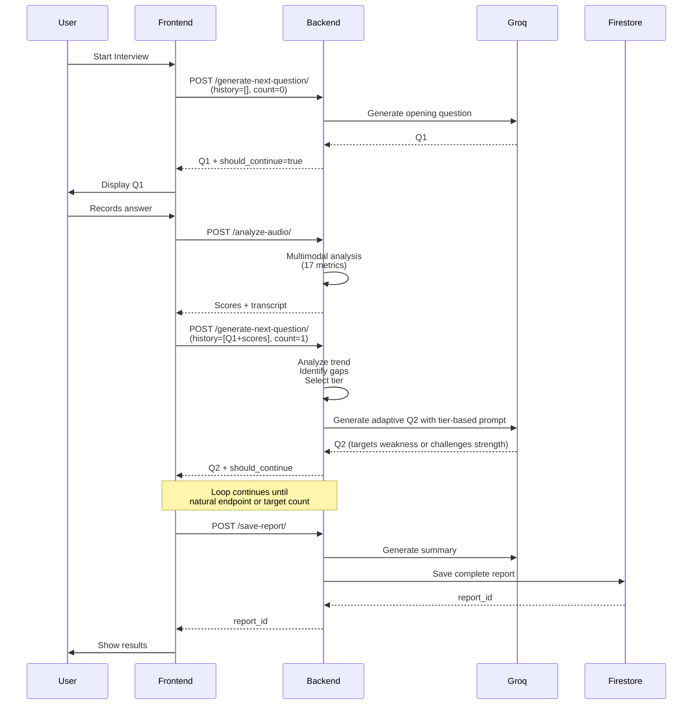

# IntWiz — AI-Powered Interview Preparation Platform

**IntWiz** is an intelligent interview preparation system that simulates real-world job interviews using multimodal AI analysis. It evaluates candidates through acoustic emotion recognition, linguistic fluency analysis, semantic relevance scoring, and structured answer assessment to provide transparent performance feedback. The system features adaptive questioning that dynamically generates follow-up questions based on candidate performance.

**🌐 Live application:** https://intwiz.vercel.app
**📡 Live API:** https://kaveenjay-intwiz.hf.space
**📚 Interactive API docs:** https://kaveenjay-intwiz.hf.space/docs

[](https://www.python.org/)
[](https://fastapi.tiangolo.com/)
[](https://www.tensorflow.org/)
[](https://react.dev/)
[](https://firebase.google.com/)
[]()

---

## 🎯 Key Features

**Multimodal Analysis Pipeline:**
- **Acoustic Emotion Recognition** — 7-class MLP classifier (angry, disgust, fearful, happy, neutral, sad, surprised) trained on 12,000+ audio samples
- **Speech-to-Text Transcription** — Whisper large v3 integration via Groq API
- **Fluency Metrics** — Words per minute (WPM) and filler word detection
- **Pause Quality Analysis** — Strategic pause vs hesitation detection (Goldman-Eisler 1968)
- **Semantic Relevance Scoring** — TF-IDF cosine similarity against CV and job description
- **Technical Depth Score** — LLM-based domain terminology density analysis (two-pass extraction)
- **Response Pacing** — Optimal answer length evaluation (Barrick et al. 2009)
- **STAR Method Analysis** — Automated assessment of answer structure

**Adaptive Interview System:**
- **AI-Generated Questions** — Personalized questions based on CV and job description
- **Adaptive Follow-Up Logic** — Each question generated dynamically based on previous performance
- **Conversation History Tracking** — Performance trends inform next question difficulty
- **Tier-Based Acknowledgment Guidance** — Four-tier prompting strategy responding to most recent answer quality
- **Intelligent Stopping Criteria** — Natural endpoint detection or fixed-length mode
- **Privacy-First Audio Storage** — Optional Firebase Cloud Storage with 30-day auto-cleanup

**Persistence & Analytics:**
- **Firebase Authentication** — Secure user account management
- **Firestore Database** — Interview reports with comprehensive metadata
- **Cloud Storage** — Optional audio recording preservation
- **Weighted Scoring Fusion** — Research-backed multi-metric score aggregation
- **AI-Generated Summaries** — Personalized feedback via Llama 3.3 70B

**Frontend Application:**
- **React 19 + TypeScript** — Type-safe component architecture
- **Editorial Design System** — Custom Tailwind palette with serif display typeface
- **Full Responsive Design** — Mobile, tablet, and desktop support
- **Accessibility Provisions** — ARIA landmarks, focus traps, keyboard navigation, screen-reader announcements
- **Adaptive Interview UI** — Live phase state machine driving the recording session
- **Performance Dashboard** — Historical report list with sortable summaries and lifetime statistics
- **PDF Report Export** — Print-formatted reports via jsPDF
- **Methodology Page** — In-app technical reference for every scoring metric

---

## 🏗️ System Architecture



### Component Breakdown

| Layer | Components | Status |
|-------|-----------|--------|
| **Frontend** | React 19 + TypeScript + Tailwind | Deployed (Vercel) |
| **API Gateway** | FastAPI with 10 endpoints | Deployed (Hugging Face Spaces) |
| **ML Pipeline** | TensorFlow + librosa + sklearn | Deployed |
| **AI Services** | Groq API (Llama 3.3 70B + Whisper large-v3) | Deployed |
| **Database** | Firebase Firestore (NoSQL) | Live |
| **Storage** | Firebase Cloud Storage | Live |
| **Auth** | Firebase Authentication | Live |

---

## 🧠 Technical Implementation

### Acoustic Emotion Recognition

- **Model:** Sequential MLP (4 dense layers: 512 → 256 → 128 → 64 → 7)
- **Input:** 193 acoustic features (40 MFCCs, 12 Chroma, 128 Mel Spectrogram, 7 Spectral Contrast, 6 Tonnetz)
- **Output:** 7-class emotion classification
- **Training Data:** 12,000+ samples from RAVDESS, TESS, CREMA-D, SAVEE
- **Performance:** 65% accuracy on test set (2,433 held-out samples)
- **Regularization:** Batch normalization + dropout between layers
- **Training:** Adam optimizer, categorical cross-entropy, batch size 32, EarlyStopping (patience=10), ReduceLROnPlateau (factor=0.5, patience=5)

### Natural Language Processing

- **Speech-to-Text:** Groq-hosted Whisper large v3 (free tier, ~2s latency)
- **Question Generation:** Llama 3.3 70B with adaptive context awareness
- **Relevance Scoring:** sklearn TF-IDF + cosine similarity with empirically calibrated 5-segment piecewise mapping
- **Technical Depth:** Two-pass LLM-based term extraction with density-weighted matching (CV/JD-aligned terms weighted 1.0; transcript-only weighted 0.5)
- **STAR Analysis:** LLM structural assessment with component detection

### Audio Processing

- **Format Conversion:** FFmpeg (browser webm → 16kHz mono wav)
- **Pause Detection:** librosa silence segmentation with `top_db=25` and `librosa.effects.trim` for leading/trailing silence removal
- **Minimum Meaningful Pause:** 0.5 seconds (filters speech-rhythm gaps)
- **Feature Extraction:** librosa for MFCCs, Chroma, Mel, Spectral Contrast, Tonnetz

### Adaptive Question Generation Flow



---

## 📊 Evaluation Metrics

The system calculates **17 metrics per answer** across 6 dimensions:

| Dimension | Metrics | Research Backing |
|-----------|---------|------------------|
| **Acoustic** | tone, confidence, engagement | Scherer (2003), DeGroot & Motowidlo (1999) |
| **Fluency** | WPM, filler words, fluency score | Bortfeld et al. (2001), Christenfeld (1995) |
| **Pause** | count, duration, quality score | Goldman-Eisler (1968) |
| **Semantic** | relevance, technical depth | Maurer & Fay (1988), Huffcutt et al. (2001) |
| **Pacing** | duration assessment, word count | Barrick et al. (2009) |
| **Structure** | STAR score, components detected | Latham et al. (1980), Campion et al. (1997) |

Full academic justification in [`EVALUATION_CRITERIA.md`](./EVALUATION_CRITERIA.md).

### Weighted Scoring Algorithm

```
final_score = (
    relevance_score × 0.25 +        # Job fit (most predictive)
    technical_depth × 0.20 +        # Domain expertise
    star_score × 0.15 +             # Answer structure
    fluency_score × 0.15 +          # Communication clarity
    pacing_score × 0.10 +           # Answer discipline
    pause_quality × 0.08 +          # Delivery confidence
    confidence_score × 0.07         # Vocal tone (limited reliability)
)
```

**Rationale:** Content metrics (60%) > Communication metrics (33%) > Acoustic metrics (7%)

---

## 🚀 Quick Start

### Prerequisites

- **Python 3.11+** with pip
- **Node.js 18+** with npm
- **FFmpeg** installed on the system PATH (required for audio conversion)
  - macOS: `brew install ffmpeg`
  - Ubuntu/Debian: `sudo apt install ffmpeg libsndfile1`
  - Windows: install from https://ffmpeg.org/download.html and add to PATH
- **Groq API key** (free at https://console.groq.com)
- **Firebase project** with Firestore, Authentication, and Cloud Storage enabled, plus an Admin SDK service-account JSON

### Installation

```bash
# Clone repository
git clone https://github.com/kaveenjay/IntWiz.3.0.git
cd IntWiz.3.0
```

### Backend Setup

```bash
cd backend

# Create virtual environment
python -m venv venv
source venv/bin/activate           # macOS/Linux
# venv\Scripts\activate            # Windows

# Install dependencies
pip install -r requirements.txt
```

Place the trained ML artefacts:
- `../models/emotion_model.h5`
- `../models/scaler.pkl`
- `../data/processed/classes.npy`

Create `backend/.env`:

```
GROQ_API_KEY=your_groq_api_key_here
FRONTEND_URLS=http://localhost:5173,http://localhost:5175
```

Place the Firebase service-account JSON as `backend/serviceAccountKey.json` (already gitignored).

Run the backend:

```bash
uvicorn main:app --reload
```

- Server: http://127.0.0.1:8000
- Interactive API docs: http://127.0.0.1:8000/docs

### Frontend Setup

```bash
cd frontend
npm install
```

Create `frontend/.env.local`:

```
VITE_API_URL=http://127.0.0.1:8000

VITE_FIREBASE_API_KEY=your_firebase_api_key
VITE_FIREBASE_AUTH_DOMAIN=your_project.firebaseapp.com
VITE_FIREBASE_PROJECT_ID=your_project_id
VITE_FIREBASE_STORAGE_BUCKET=your_project.firebasestorage.app
VITE_FIREBASE_MESSAGING_SENDER_ID=your_sender_id
VITE_FIREBASE_APP_ID=your_app_id
```

Firebase configuration values: Firebase Console → Project Settings → Your apps → SDK setup and configuration.

Run the frontend:

```bash
npm run dev
```

The application is available at http://localhost:5173.

---

## 📡 API Endpoints

The backend exposes 10 REST endpoints across 5 functional groups.

### Discovery

#### `GET /`
Health check; returns service liveness confirmation.

---

### Question Generation

#### `POST /generate-questions/`
Pre-generates a fixed set of interview questions from CV and job description.

**Request:**
- `cv_file`: PDF (required)
- `job_description_file`: PDF (optional)
- `job_description_text`: String (optional)
- `num_questions`: Integer (default: 7)

#### `POST /generate-next-question/`
Adaptive question generation based on conversation history.

**Request:**
- `cv_text`: String
- `job_description_text`: String
- `conversation_history`: JSON array of previous Q&A with scores
- `current_question_count`: Integer
- `target_questions`: Integer (0 = adaptive mode)

**Response:**

```json
{
  "question": "Can you describe a specific project where...",
  "should_continue": true,
  "question_number": 3,
  "reasoning": "Adaptive question for Q3; performance trend: improving"
}
```

---

### Audio Analysis

#### `POST /analyze-audio/`
Comprehensive multimodal analysis of interview answers.

**Request:**
- `file`: Audio file (.wav, .mp3, .ogg, .webm, .m4a, .mp4)
- `cv_text`: String (optional)
- `job_description_text`: String (optional)
- `question`: String (optional)
- `save_audio`: Boolean (default: false) — opt-in audio storage
- `user_id`: String (required if saving audio)
- `interview_id`: String (required if saving audio)
- `question_number`: Integer (default: 1)

**Response:** 17 metrics including transcript, scores, and optional audio URL.

---

### Report Management

#### `POST /save-report/`
Saves a complete interview to Firestore with an AI-generated summary.

#### `GET /get-report/{report_id}`
Fetches a single interview report with full data.

#### `DELETE /delete-report/{report_id}`
Deletes a report and any associated audio files. Requires `user_id` query parameter for ownership verification.

#### `GET /get-user-reports/{user_id}`
Lists a user's interviews sorted by date (newest first). Optional `limit` query parameter (default: 20).

---

### User Preferences

#### `GET /get-preferences/{user_id}`
Retrieves a user's default interview-mode, target-question-count, and audio-save preferences.

#### `POST /save-preferences/`
Persists a user's preferences.

**Request:**
- `user_id`: String
- `default_mode`: String (`adaptive` or `fixed`)
- `default_target_questions`: Integer (5, 7, or 10)
- `default_save_audio`: Boolean

---

## 🛠️ Technology Stack

### Backend
- **Framework:** FastAPI 0.115.6
- **ML/DL:** TensorFlow 2.18.0, scikit-learn 1.6.1
- **Audio:** librosa 0.10.2, FFmpeg
- **LLM/STT:** Groq API (Llama 3.3 70B, Whisper large v3)
- **PDF Processing:** PyMuPDF (fitz)
- **Database:** Firebase Firestore (NoSQL)
- **Storage:** Firebase Cloud Storage
- **Auth:** Firebase Authentication

### Frontend
- **Framework:** React 19 + TypeScript
- **Build tool:** Vite 8.0
- **Styling:** Tailwind CSS 3.4 with custom editorial design system
- **State:** React Context + hooks (no external state library)
- **Routing:** React Router DOM v7
- **HTTP:** Axios
- **Auth:** Firebase Auth SDK
- **PDF Generation:** jsPDF 4.2

### Datasets (Training)
- **RAVDESS** — Ryerson Audio-Visual Database of Emotional Speech and Song
- **TESS** — Toronto Emotional Speech Set
- **CREMA-D** — Crowd-sourced Emotional Multimodal Actors Dataset
- **SAVEE** — Surrey Audio-Visual Expressed Emotion Dataset

---

## 📊 Development Status

| Phase | Status | Features |
|-------|--------|----------|
| **Phase 1: ML Foundation** | Complete | TensorFlow emotion classifier, FastAPI setup, acoustic feature extraction |
| **Phase 2: NLP Integration** | Complete | Whisper STT, question generation, fluency metrics, relevance scoring, STAR analysis |
| **Phase 3: Backend Services** | Complete | Firebase integration, adaptive questioning, audio storage, report persistence |
| **Phase 4: Frontend** | Complete | React UI, interview simulation, results dashboard, PDF export, accessibility |
| **Phase 5: Deployment** | Complete | Vercel (frontend) + Hugging Face Spaces (backend) — both on free tier |

---

## 📝 Known Limitations

### Acoustic Model Domain Shift

The emotion recognition model was trained on **acted emotional expressions** (theatrical speech) from RAVDESS, TESS, CREMA-D, and SAVEE. This creates accuracy issues when applied to professional interview speech, which is naturally controlled and measured. Documented in [DECISIONS.md](./DECISIONS.md).

**Impact:** Acoustic scores may underestimate professional delivery quality.

**Mitigation:** Linguistic features (relevance, fluency, technical depth, STAR) carry higher weight in final scoring (93% vs 7% acoustic).

### TF-IDF Synonym Handling

Cannot recognize synonyms ("machine learning" vs "ML") or paraphrasing. Hybrid scoring with sentence transformers documented as future enhancement.

### Adaptive Mode Boundaries

Stopping criteria are heuristic-based (10 question max, last-three-below-40 score threshold). A production system would benefit from validation studies to optimize these thresholds.

### Formal User Evaluation

Formal user-evaluation data (e.g., System Usability Scale assessment) was not collected during development. Calibration evidence and informal external feedback served as validation. A structured five-user evaluation following Nielsen (2000) is acknowledged as a methodological improvement for future iteration.

---

## 🎓 Academic Context

**Final Year Individual Project**
**BSc (Hons) Data Science — University of Plymouth**
**Module:** PUSL3190
**Student:** Kaveen Jayamanne (ID: 10953765)
**Supervisor:** Ms. Lakni Peiris

**Research Areas:**
- Applied Machine Learning & Deep Learning
- Natural Language Processing
- Adaptive Learning Systems
- Human-Computer Interaction
- Explainable AI in Automated Assessment

**Project Objectives:**
1. Demonstrate multimodal AI integration in a practical application
2. Evaluate trade-offs between model complexity and explainability
3. Address domain adaptation challenges (acted vs professional speech)
4. Implement adaptive questioning with real-time performance analysis
5. Build production-ready software with proper documentation and testing
6. Deploy to publicly accessible free-tier infrastructure preserving accessibility commitments

---

## 📚 Documentation

- **[DECISIONS.md](./DECISIONS.md)** — Technical architecture decisions and justifications
- **[EVALUATION_CRITERIA.md](./EVALUATION_CRITERIA.md)** — Research-backed evaluation framework
- **[backend/README.md](./backend/README.md)** — Backend-specific setup and API details
- **[frontend/README.md](./frontend/README.md)** — Frontend-specific setup and structure
- **In-app Methodology page** — https://intwiz.vercel.app/methodology
- **Live Swagger UI** — https://kaveenjay-intwiz.hf.space/docs
- **Code Comments** — Inline explanations of algorithms and design choices

---

## 🔮 Future Enhancements

1. **Domain-Specific Model Fine-Tuning**
   - Collect real interview recordings with expert labels
   - Retrain acoustic model on professional speech patterns
   - Recalibrate engagement metrics for controlled delivery

2. **Hybrid Semantic Scoring**
   - Combine TF-IDF with lightweight sentence transformers
   - Handle synonyms and paraphrasing effectively

3. **Formal User Evaluation**
   - Conduct a structured SUS-based assessment with five or more participants
   - Use findings to refine UI affordances and feedback presentation

4. **Advanced Analytics**
   - Comparative analysis across multiple sessions
   - Skill gap identification and learning path recommendations
   - Industry benchmark comparisons

5. **Difficulty Adaptation**
   - Item Response Theory implementation
   - Questions auto-adjust complexity based on performance

6. **Extended Platform Features**
   - Video analysis (facial expressions, eye contact)
   - Real-time feedback during practice
   - Custom question bank creation for recruiters
   - Multi-language support (Whisper supports 99 languages)

---

## 📈 Project Statistics

- **Total Endpoints:** 10 working REST APIs
- **Metrics per Answer:** 17 across 6 dimensions
- **Pages (Frontend):** 11 distinct page components
- **Reusable Components / Hooks:** 3 components, 2 hooks, 1 context, 2 services
- **Training Dataset Size:** 12,000+ audio samples (4 corpora)
- **Model Parameters:** 274,183 trainable
- **Test-set Accuracy:** 65% (7-class emotion recognition)
- **Git Commits:** 59 (Feb 2026 – May 2026)
- **Deployment Cost:** £0 (free-tier across Hugging Face Spaces and Vercel)

---

## 📧 Contact

**Developer:** Kaveen Jayamanne
**Email:** jayamannekaveen@gmail.com
**LinkedIn:** [linkedin.com/in/jayamannekaveen](https://linkedin.com/in/jayamannekaveen)
**Institution:** University of Plymouth

---

## 📄 License

This project was developed for academic purposes as part of a University of Plymouth final-year project. The source code, ML models, and design assets are provided as supporting evidence for the dissertation submission.

Third-party libraries and frameworks retain their respective licenses.

---

*Last Updated: May 2026 | All Phases Complete | Production Deployed*